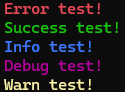

# GoColor

GoColor is a simple library that allows you to add colors and styles to your terminal output in Golang. It makes it easy to apply text colors, background colors, and various text styles to enhance the readability of your logs and terminal outputs.

## Installation

To install GoColor, use the following command:
```bash
go get github.com/JustTimmm/GoColor
```

Then, import the library into your project:
```go
import "github.com/JustTimmm/GoColor"
```

## Usage

With GoColor, you can apply text colors, background colors, and text styles (like bold, italic, etc.) to your strings. Here is a basic example:
```go
package main

import "github.com/JustTimmm/GoColor"

func main()  {
	// Text color
	GoColor.ColorLog(GoColor.ColorOption{TextColor: GoColor.Red}, "GoColor on top !\n")
	
	// Background color
	GoColor.ColorLog(GoColor.ColorOption{BackgroundColor: GoColor.BackgroundBlue}, "GoColor on top !\n")
	
	// Background & Text color
	GoColor.ColorLog(GoColor.ColorOption{BackgroundColor: GoColor.BackgroundBlue, TextColor: GoColor.Red}, "GoColor on top !\n")
}
```


## Default logs

There are different predefined logs for 5 log types!
```go
GoColor.ErrorLog("Error log!\n")
GoColor.SuccessLog("Success log!\n")
GoColor.InfoLog("Info log!\n")
GoColor.DebugLog("Debug log!\n")
GoColor.WarnLog("Warn log!\n")
```


## License

This project is licensed under the MIT LICENSE. See the LICENSE file for more details.