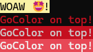
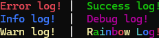

<h1 align="center">🎨 GoColor</h1> <p align="center"> <strong>GoColor</strong> is a lightweight Go library for adding <em>colors</em> and <em>styles</em> to your terminal output.<br> Instantly enhance the readability of your logs and CLI messages! </p>

## 🚀 Installation

To install GoColor, run:
```bash
go get github.com/JustTimmm/GoColor
```

Then import it into your project:
```go
import "github.com/JustTimmm/GoColor"
```

## ✨ Quick Example

With GoColor, you can apply text colors, background colors, and text styles (like bold, italic, etc.) to your strings. Here is a basic example:
```go
package main

import "github.com/JustTimmm/GoColor"

func main() {
	// Text color
	GoColor.ColorLog(GoColor.ColorOption{
		TextColor: GoColor.Red,
	}, "GoColor on top!\n")

	// Background color
	GoColor.ColorLog(GoColor.ColorOption{
		BackgroundColor: GoColor.BackgroundBlue,
	}, "GoColor on top!\n")

	// Text + Background color
	GoColor.ColorLog(GoColor.ColorOption{
		TextColor: GoColor.Red,
		BackgroundColor: GoColor.BackgroundBlue,
	}, "GoColor on top!\n")
}
```



## 🛠️ Predefined Logs

GoColor includes several built-in styled logs:
```go
GoColor.ErrorLog("Error log!\n")
GoColor.SuccessLog("Success log!\n")
GoColor.InfoLog("Info log!\n")
GoColor.DebugLog("Debug log!\n")
GoColor.WarnLog("Warn log!\n")
GoColor.RainbowLog("Rainbow Log!\n")
```


## License

This project is licensed under the MIT License. See the LICENSE file for details.